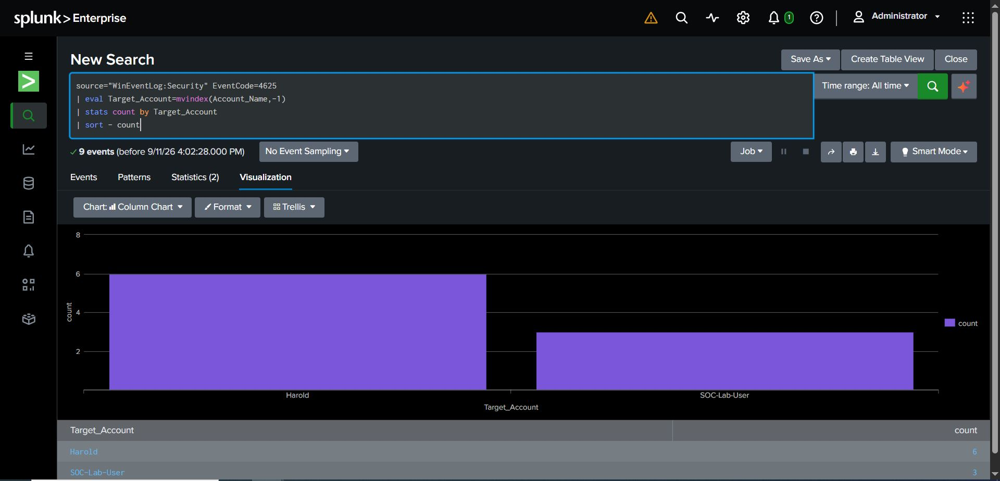

# Splunk SIEM Failed-Login Investigation
## Overview
This project documents a SOC investigation of Windows failed-login events in Splunk Enterprise. I used SPL queries to identify Event ID 4625 activity, analyze target accounts and source addresses, correct a multivalue-field counting issue, and determine whether the activity required escalation.
The project also includes a proposed detection rule, alert threshold, tuning recommendations, MITRE ATT&CK mapping, and an escalation runbook.
## Objectives
- Detect Windows failed-login events
- Identify targeted accounts
- Analyze source network addresses
- Determine the logon type and failure reason
- Correct inaccurate results caused by a multivalue field
- Distinguish malicious activity from benign testing
- Develop a repeatable detection and escalation process
- Document the final SOC disposition
## Environment
- Splunk Enterprise
- Windows Security Event Log
- Source: `WinEventLog:Security`
- Event ID: `4625`
- Analysis period: All time
- Total events investigated: 9
## MITRE ATT&CK Mapping
- **Tactic:** Credential Access
- **Technique:** T1110 — Brute Force
- **Sub-technique:** T1110.001 — Password Guessing
The observed events were generated during authorized testing. However, repeated Event ID 4625 activity can indicate password guessing when the source, frequency, account, or surrounding activity is suspicious.
## Initial Detection Query
```spl
source="WinEventLog:Security" EventCode=4625
```
This search returned nine Windows failed-login events.
## Target-Account Analysis
The initial account query produced inflated totals because Windows Event ID 4625 contains multiple `Account_Name` values. I normalized the field with `mvindex()` to isolate the target account.
```spl
source="WinEventLog:Security" EventCode=4625
| eval Target_Account=mvindex(Account_Name,-1)
| stats count by Target_Account
| sort - count
```
### Results
| Target account | Failed logins |
|---|---:|
| Harold | 6 |
| SOC-Lab-User | 3 |
| **Total** | **9** |
## Source-Address Analysis
```spl
source="WinEventLog:Security" EventCode=4625
| stats count by Source_Network_Address
| sort - count
```
### Results
| Source address | Count | Interpretation |
|---|---:|---|
| `-` | 3 | No network address recorded |
| `127.0.0.1` | 3 | IPv4 loopback address |
| `::1` | 3 | IPv6 loopback address |

No external or remote IP address appeared in the results.
## Logon-Type Analysis
```spl
source="WinEventLog:Security" EventCode=4625
| stats count by Logon_Type
| sort - count
```
All nine events used **Logon Type 2**, representing interactive logon attempts at the local computer.
## Detailed Evidence Query
```spl
source="WinEventLog:Security" EventCode=4625
| eval Target_Account=mvindex(Account_Name,-1)
| fillnull value="Not recorded" Target_Account Workstation_Name Source_Network_Address Failure_Reason Logon_Type
| stats count by Target_Account, Workstation_Name, Source_Network_Address, Logon_Type, Failure_Reason
| sort - count
```
The events showed the failure reason **“Unknown user name or bad password.”**
## Proposed Detection Rule
The following SPL detects five or more failed logins against the same target account within a ten-minute window:
```spl
source="WinEventLog:Security" EventCode=4625
| eval Target_Account=mvindex(Account_Name,-1)
| bin _time span=10m
| stats count values(Source_Network_Address) as Source_Addresses values(Workstation_Name) as Workstations by _time, host, Target_Account
| where count >= 5
| sort - count
```
## Suggested Alert Configuration
- **Alert name:** Repeated Windows Failed Logins
- **Search schedule:** Every 5 minutes
- **Search window:** Last 10 minutes
- **Trigger condition:** Number of results is greater than 0
- **Initial severity:** Medium
- **Recommended action:** Create a SOC ticket and notify the monitoring queue
- **Escalation target:** Senior SOC analyst or incident-response team
## Detection-Tuning Recommendations
- Normalize the multivalue `Account_Name` field before counting events
- Exclude approved testing accounts only when activity is documented
- Review computer and service accounts separately
- Treat external source IP addresses as higher risk
- Use a lower threshold for privileged or administrative accounts
- Correlate failed logins with successful Event ID 4624 activity
- Identify failures followed by a successful login from the same source
- Review activity across multiple accounts or workstations
- Adjust thresholds based on the environment’s normal login behavior
## SOC Triage Runbook
1. Confirm the alert time range, event count, target account, host, and source address.
2. Verify that the events are Windows Security Event ID 4625.
3. Normalize the target-account field to prevent duplicate counting.
4. Determine whether the source is local, loopback, internal, or external.
5. Review the logon type and failure reason.
6. Check whether the account is privileged, disabled, locked, or recently created.
7. Search for successful Event ID 4624 logins following the failures.
8. Determine whether multiple accounts or systems were targeted.
9. Compare the activity with approved testing or administrative work.
10. Classify the activity as malicious, suspicious, benign, or a false positive.
11. Record the investigation, evidence, actions, and recommendation in the ticketing system.
12. Escalate confirmed or high-risk incidents according to the SOC runbook.
## Escalation Criteria
Escalate the incident when one or more of the following conditions exist:
- Failed logins originate from an unknown external IP address
- A successful login follows repeated failures
- A privileged or administrative account is targeted
- Multiple user accounts or workstations are affected
- Activity continues after account lockout or password reset
- The source is associated with known malicious activity
- Additional malware, phishing, or lateral-movement indicators are present
## Evidence
### Failed Logins by Target Account

## SOC Analysis and Disposition
- **Detection:** True positive — failed-login events occurred
- **Severity:** Informational/Low
- **Source:** Local system and loopback addresses
- **Remote threat evidence:** None identified
- **Likely cause:** Authorized lab testing and incorrect credential attempts
- **Escalation required:** No
- **Final disposition:** Benign authorized activity; document and close
## Skills Demonstrated
- Splunk Enterprise
- Search Processing Language (SPL)
- Windows Event ID 4625 analysis
- Field extraction and multivalue-field normalization
- Account and source-IP analysis
- MITRE ATT&CK mapping
- Detection-rule development
- Alert-threshold planning and tuning
- True-positive and benign-activity determination
- SOC triage and escalation procedures
- Runbook and incident documentation
## Key Takeaway
This investigation demonstrated that alert counts must be validated before making a security decision. Normalizing the multivalue `Account_Name` field prevented double-counting and produced an accurate total of nine failed-login events.
The investigation also showed that a true-positive detection does not always represent malicious activity. Source addresses, logon types, account context, and authorized testing must be reviewed before escalation.
